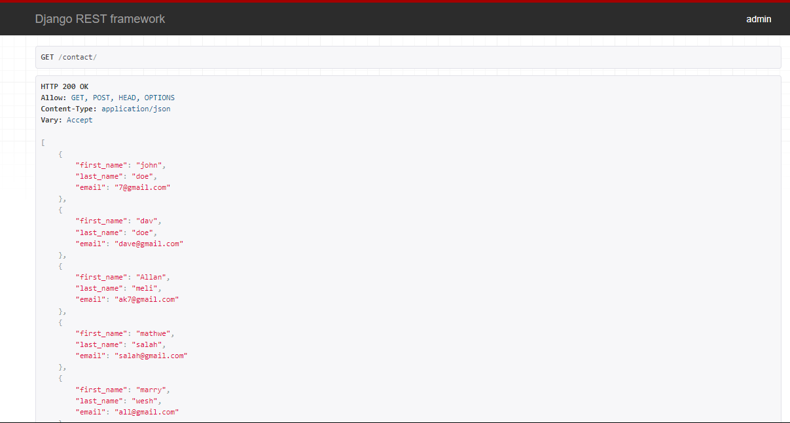

# Homework-10

Let's create a small contacts API.

Set your virtual environment

```bash
#Get your code. Use your assignment link.
git clone https://github.com/ITEC660/homework-10-profkemalaydin

#Create virtual environment

#Activate the env

#Install Django

#Fire up a new project. name:mycontacts

#Create your new app for your contacts API. ie: contactsapi
cd mycontacts
python manage.py startapp contactsapi

#Install Django REST Framework (DRF)
pip install django-rest-framework

```

Create a model and register it.

```bash
#Open the file contactsapi/models.py and edit:

from django.db import models

# Create your models here.
class Contact(models.Model):
    first_name = models.CharField(max_length=100)
    last_name = models.CharField(max_length=100)
    email = models.EmailField(max_length=150)

#Open the file contactsapi/admin.py and edit:
from django.contrib import admin
from .models import Contact
admin.site.register(Contact)
```

Register the app and the REST framework. 

```bash
# Open the file mycontacts/settings.py and edit:
INSTALLED_APPS = [
    'django.contrib.admin',
    'django.contrib.auth',
    'django.contrib.contenttypes',
    'django.contrib.sessions',
    'django.contrib.messages',
    'django.contrib.staticfiles',
    'contactsapi',
    "rest_framework",
]
```

Serialize the model. We can use DRF serializers.

```bash
#Create the file contactsapi/serializers.py and add the code below:
from rest_framework import serializers
from .models import Contact

class ContactSerializer(serializers.ModelSerializer):
    class Meta:
        model = Contact 
        fields = ('first_name', 'last_name')
```

Update the view

```bash
#Edit the file contactsapi/views.py:
from django.shortcuts import render
from rest_framework import viewsets
from .serializers import ContactSerializer
from .models import Contact

class ContactViewSet(viewsets.ModelViewSet):
    queryset = Contact.objects.all().order_by('first_name')
    serializer_class = ContactSerializer
```

Update URLs

```bash
# Edit mycontacts/urls.py
from django.urls import path, include
from django.contrib import admin

urlpatterns = [
    path('admin/', admin.site.urls),
    path('', include('contactsapi.urls')),

]

# Go to contactsapi fodler
# Create a new file urls.py and add the following code:
from django.urls import path, include
from rest_framework import routers
from . import views

router = routers.DefaultRouter()
router.register(r'contact', views.ContactViewSet)

urlpatterns = [
    path('', include(router.urls)),    
]
```

Run migrations and add data

```bash
# Run your migrations
python manage.py makemigrations

# Migrate the model changes into the main database
python manage.py migrate

# Check if everything is passed, stated by an **… OK** ending

# create super user
python manage.py createsuperuser

# If you see the error below: 
# Superuser creation skipped due to not running in a TTY.
# You can try winpty
winpty python manage.py createsuperuser

# Serve the app
python manage.py runserver

#Open the admin site
http://localhost:8000/admin/
#Login and add five sample contacts.
```
Add your screenshots for the following tasks and make sure to upload them into canvas
1. Open http://localhost:8000/contact/ and make sure you can see the contacts that you have added.
    
2. Order the contacts by last name.
    
3. Change the Serializer to include the email information, too.
    
4. Access one contact via API http://localhost:8000/contact/4/
    
5. Add one more contact using API. (Tip: use the HTML form with the PUT method)
    
